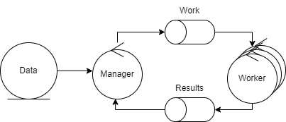

# Grid Search

## Architecture



The system is composed by a manager node and a number of worker nodes.

## Specifications

### Function

The function to be evaluated will be defined in the worker nodes, using the selected programming language, following the following interface:

```c
function( args: number[] ): number

```

The function to be evaluated will be the [Grienwank function](https://en.wikipedia.org/wiki/Griewank_function) in 3 dimensions.

### Data

The data will be generated by the manager node, and will be sent to the worker nodes in batches.

The parameters will be received from a json file with the following structure:

```json
{
  "data": [
    [start, end, step],
    ...
  ],
  "agg": "MIN" | "MAX" | "AVG",
  "maxItemsPerBatch": num
}
```

- data: a list of intervals where the parameters will be generated to evaluate the function.
- agg: the aggregation function to be used to aggregate the results of the function evaluation.
- maxItemsPerBatch: the maximum number of items to be sent to the worker nodes in each batch.

The intervals to be evaluated, for each of the 3 dimensions, is [-600, 600, 0.2], the aggregation function is "MIN" and the maximum number of items per batch is 10800000.

## Benchmarks

Benchmarks will be run using 4, 8 and 16 worker nodes.

- Measurements
  - Completion Time
  - CPU usage
  - Node throughput and Combined throughput
  - Memory usage
  - Network usage
  - Coefficient of variation of worktime and results produced
