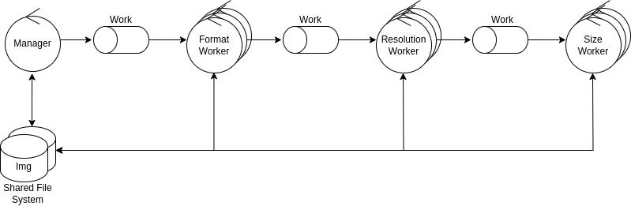

# Image Processing Pipeline

## Architecture

The system is composed by a manager node and a number of format, resolution and size worker nodes.

The work is distributed through messaging, but the files are accessed through a shared file system.

## Specifications

### Processes

- Format: Converts an image into png format.
- Resolution: Resizes an image to a given resolution. The chosen resolution is: 100x100
- Size: Resizes an image to a given size. The chosen size is: 30x30

### Data

[BIRDS 525 SPECIES](https://www.kaggle.com/datasets/gpiosenka/100-bird-species) dataset will be used for the benchmarks.
This dataset is further augmented using [image_multiplicator.py](https://github.com/tpf-concurrent-benchmarks/various/blob/main/image_processing/image_multiplicator.py)

## Benchmarks

Benchmarks will be run using 2, 4 and 6 worker nodes (of each type).

- Measurements
  - Completion Time
  - CPU usage
  - Node throughput and Combined throughput
  - Memory usage
  - Network usage
  - Coefficient of variation of worktime and results produced
